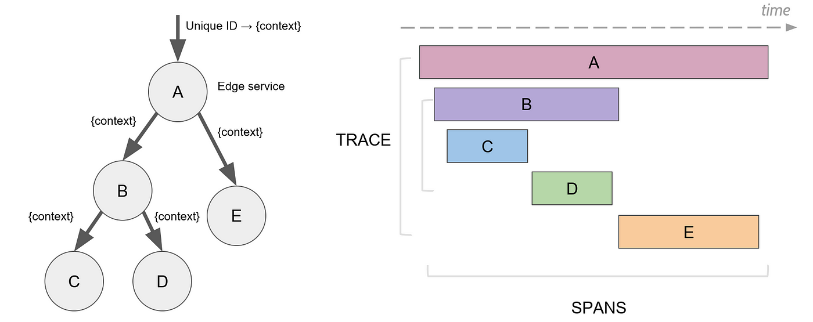

# Jaeger Tracing 

___
## Distributed tracing
___

In the past, applications were structured as monolithic blocks, making maintenance 
and updates difficult since any change could impact the entire system. 
The shift to a microservices architecture, with applications divided into independent 
components, has improved scalability and maintainability but introduced new challenges 
in coordinating and monitoring interactions between services. 

A single user request can pass through many independent services, complicating the identification 
of performance issues. **Distributed tracing** addresses this by centralizing information from 
various services,allowing each action within the microservices to be tracked. This makes it 
possible to trace a single request throughout its entire journey, from origin to destination, 
facilitating the identification and management of system issues.


## Jaeger introduction
___

[Jaeger](https://www.jaegertracing.io) is an open-source distributed tracing tool used to monitor and troubleshoot microservices-based architectures. Its main purpose is 
to trace the path of user requests across different microservices, providing developers with a clear 
view of data flows and interactions within the system. This helps identify bottlenecks, optimize performance, 
and better understand dependencies between components. Specifically Jaeger:
- tracks how data moves within the system.
- helps identify which microservices are slowing down the system to optimize latency.
- shows relationships between microservices to analyze how changes in one component might affect others, 
aiding in root cause analysis.


## How Jaeger Works
___

**Jaeger** (as mentioned earlier) leverages the principles of distributed tracing and is based on the 
OpenTracing framework. 
The data model of OpenTracing (and therefore Jaeger) includes two key concepts: the "_span_" and the "_trace_". 
- **Span**: A logical unit of work in a distributed tracing system. When a request flows through the system, 
each activity associated with it is recorded as a span and includes details like the operation name and
start/end time. 
Once an operation is completed, the _parent span_ references the next _child span_. Together, these spans form a trace.

- **Trace**: A collection of one or more spans that represent the full sequence of operations needed to 
complete a request across multiple microservices. 
All spans in a trace share the same ID and together form the complete execution path of the request.



Let's now look at the main components of Jaeger, so we can understand how it works.


- **Strumentation**: process of adding code to the application, in order to generate and collect *telemetry data*, 
such as logs, metrics, and traces.
In Jaeger this is possible thanks to the use of official libraries (aka <u>client-libraries</u>), which are based on 
OpenTracing API and support different programming languages.
- **Data pipeline**: this component manages the flow of trace data from the application to the storage backend. 
The main modules are:
  - <u>Jaeger Agent</u>: a background daemon that acts as an intermediary between the client and the collection system. 
  It receives spans generated by the application via UDP and pushes them to the collectors. 
  UDP is used to minimize performance impact on the system. 
  - <u>Jaeger Collector</u>: This module receives spans from the Jaeger Agent, validates, processes, and indexes them. 
  Collectors ensure that the data is ready to be stored in the long-term storage system.

- **Backend storage**: component that handles the storage of data collected by Jaeger. Trace data is stored in either 
SQL or NoSQL databases, depending on the needs. Notable NoSQL options include *Cassandra* and *ElasticSearch*. 

- **Visualization**: Jaeger provides a web UI that lets developers search for specific traces using <u>Queries</u> 
(based on criteria such as service name and request duration) and then display them in a format that clearly shows the 
request path through the microservices.
For each span, the interface provides details such as execution times and span hierarchy, which helps diagnose specific 
issues within the trace.


## Sampling
___
**Sampling** is crucial in Jaeger for selecting a subset of generated traces for analysis. It helps avoid overwhelming 
the backend with excessive data, especially in high-traffic microservices environments. 

Sampling occurs at two distinct 
levels:

### SDK-Level Sampling
**Head-based sampling** happens in the Jaeger client code before traces are sent to the backend. It allows filtering at the source. 
Modes include: 
- **Rate**: Limits the number of traces sampled per second, useful in high-traffic contexts to prevent data overload. 
- **Constant**: Samples either all traces or none, suitable for test environments or scenarios requiring full visibility or none. 
- **Probabilistic**: Samples traces randomly based on a defined percentage, balancing data collection with efficiency. 

### Collector-Level Sampling 
**Tail-based sampling** occurs after trace collection but before storage, determining which traces to keep or discard. 
Modes include:
- **File Sampling**: Uses a configuration file with rules for handling traces, offering detailed control over sampling behavior. 
- **Adaptive Sampling**: Adjusts sampling frequency dynamically based on system conditions, such as workload variations, 
making it suitable for dynamic environments.


## Maven dependencies
___

```
<dependency>
    <groupId>io.opentracing.contrib</groupId>
    <artifactId>opentarcing-spring-jaeger-web-starter</artifactId>
    <version>3.3.1</version>
</dependency>
```